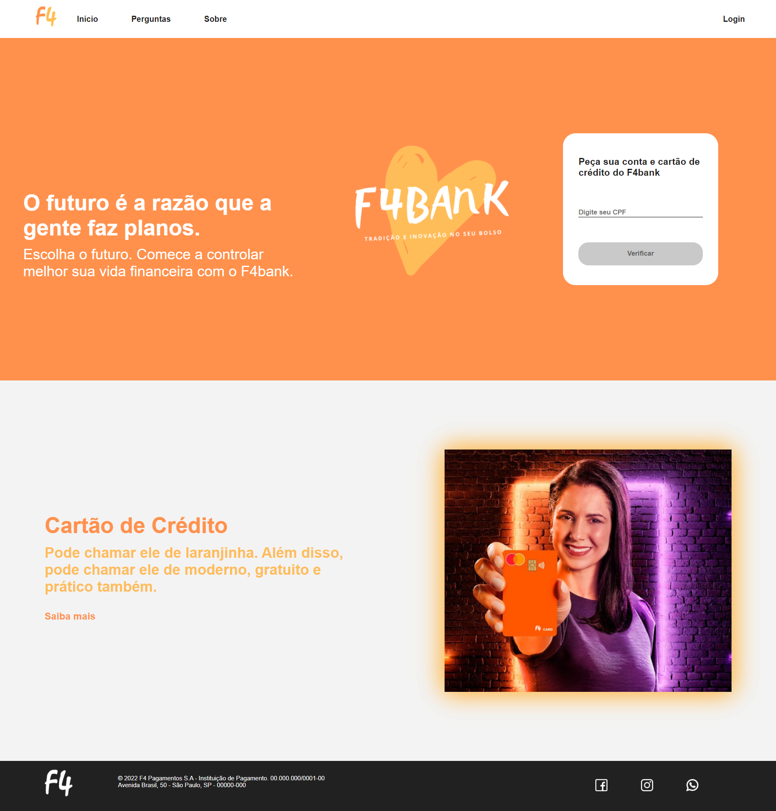

<h1 align="center">Landing-Page F4Bank</h1>

<p align="center">
  <a href="#-tecnologias">Tecnologias</a>&nbsp;&nbsp;&nbsp;|&nbsp;&nbsp;&nbsp;
  <a href="#-projeto">Projeto</a>&nbsp;&nbsp;&nbsp;|&nbsp;&nbsp;&nbsp;
  <a href="#-website">Website</a>&nbsp;&nbsp;&nbsp;|&nbsp;&nbsp;&nbsp;
  <a href="#-como-executar">Como executar</a>&nbsp;&nbsp;&nbsp;
  


<p align="center"></p>


## 👨‍💻 Tecnologias

Projeto desenvolvido com as seguintes tecnologias:

- HTML
- CSS

## 💻 Projeto

F4Bank, uma Landing-Page fictícia criada para o curso Web-Fullstack da Labenu.

## 📲 Website

Link para visualização no surge: (<a href:"https://fanatical-grandmother.surge.sh/" target:"_blank">fanatical-grandmother.surge.sh</a>)

## 🚀 Como executar

 Clonar o repositorio:
```bash
$ git clone https://github.com/future4code/Silveira-landing-page11.git
```
Acessar o repertório:
```bash
$ cd fanatical-grandmother.surge.sh

```
****
## ✒️ Author

Davi Souza  [https://github.com/Lets-DavIt]</br>
João Vitor Souza [https://github.com/jaoska]</br>
Lucas Quevedo [https://github.com/lucasquevedo1d] 
